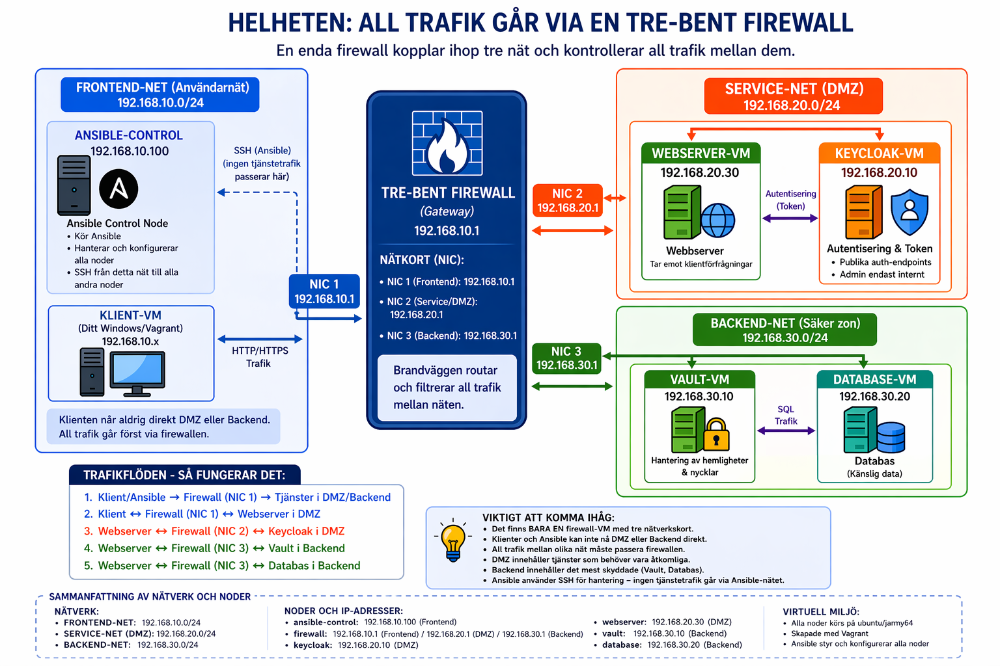

Här beskriver vi vår arbets- och tankegång:
Vi började med att sätta upp en ritning och planerade för hur vårt projekt ska fungera visuelt, för att kunna diskutera kring lösningen och få alla att tänka lika.
Sedan satte vi upp själva skelettet genom att strukturera vår vagrantfil för att skapa våra VM, samt sätta strukturen för vårt nätverk och den statiska routningen. Ett problem som dök upp var att vi hade börjat projektet utan att ha med en.gitignore-fil vuilket gjorde det svårt att rensa bort sådana filer som Git redan hade indexerat. Samt så var det lite utmanande att förstå att försat routningen måste ske statiskt innan ssh-nycklarna fanns på plats, kolla med Almir om detta stämmer.. 
Föklara hur vagrantfilrn är uppyggd och trukturerad
Förklara strukturen kring mappar, roller och tasks för ansible.
Förklara de olika Vm:arnas roller
Gör ett testscript
Kontrollera kopplingar och trafik för VM med script.

# Virtualiseringsteknik – Segmenterad labbmiljö med Vagrant och Ansible

> En segmenterad labbmiljö byggd i VirtualBox med Vagrant och Ansible. Miljön består av en tre-bent brandvägg mellan frontend, DMZ och backend, där Ansible används för att konfigurera noderna och tillämpa grundläggande säkerhetsåtgärder.

---

## Innehållsförteckning

- [Arkitektur](#arkitektur)
- [Miljöer och IP-adresser](#miljöer-och-ip-adresser)
- [Mappstruktur](#mappstruktur)
- [Komponenter](#komponenter)
- [Krav och förutsättningar](#krav-och-förutsättningar)
- [Kom igång](#kom-igång)
- [Secrets](#secrets)
- [Säkerhetsåtgärder](#säkerhetsåtgärder)
- [Säkerhetsanalys](#säkerhetsanalys)
- [Verifiering](#verifiering)
- [Designval och motivering](#designval-och-motivering)

---

## Arkitektur



Miljön består av tre nätsegment och en central tre-bent brandvägg:

- **Frontend-net**: `192.168.10.0/24`
- **Service-net / DMZ**: `192.168.20.0/24`
- **Backend-net**: `192.168.30.0/24`

Brandväggen routar och filtrerar trafik mellan näten. Ansible-control ligger i frontend-nätet och används för administration via SSH. Webserver och Keycloak ligger i DMZ. Vault och databas ligger i backend.

---

## Miljöer och IP-adresser

| VM | Roll | IP-adress | Port forwarding | Beskrivning |
|---|---|---|---|---|
| `ansible-control` | Kontrollnod | 192.168.10.100 | Vagrant SSH via NAT | Kör Ansible och hanterar övriga noder |
| `firewall` | Gateway / brandvägg | 192.168.10.1 / 192.168.20.1 / 192.168.30.1 | Vagrant SSH via NAT | Routar och filtrerar trafik mellan frontend, DMZ och backend |
| `webserver` | Applikationsserver | 192.168.20.30 | — | Ska senare exponera webbapplikationen i DMZ |
| `keycloak` | Identitet och token | 192.168.20.10 | — | Ska senare hantera autentisering |
| `vault` | Secrets manager | 192.168.30.10 | — | Ska senare lagra och lämna ut applikationshemligheter |
| `database` | Databasserver | 192.168.30.20 | — | Ska senare innehålla applikationsdata |

---

## Mappstruktur

```text
repo/
├── roles/
│   ├── common/
│   │   └── tasks/
│   │       └── main.yml
│   ├── firewall/
│   │   ├── tasks/
│   │   │   └── main.yml
│   │   ├── handlers/
│   │   │   └── main.yml
│   │   └── templates/
│   │       └── nftables.conf.j2
│   ├── keycloak/
│   ├── vault/
│   ├── database/
│   └── webserver/
├── docs/
│   └── architecture.png
├── inventory.ini
├── site.yml
├── Vagrantfile
├── .gitignore
└── README.md