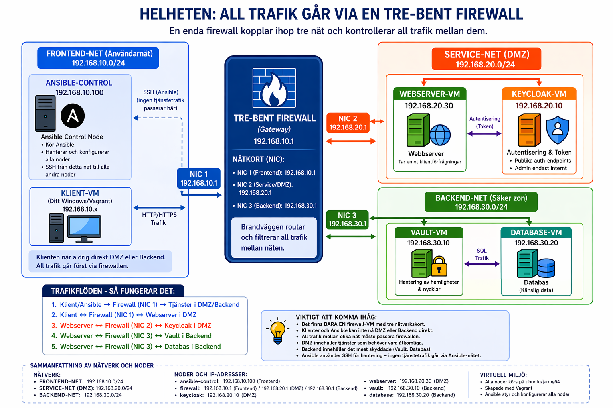

# Virtualiseringsteknik – Segmenterad labbmiljö med Vagrant och Ansible

> En segmenterad labbmiljö byggd i VirtualBox med Vagrant och Ansible. Projektet visar hur en miljö kan delas upp i frontend, DMZ och backend, där trafiken mellan zonerna styrs av en central tre-bent brandvägg. I den version som finns nu fungerar DMZ-delen med webserver, Keycloak, verifieringsscript och demo i webbläsare via port forwarding.

---

## Syfte

Syftet med labben är att bygga upp ett segmenterat och automatiserat system där flera säkerhetsprinciper syns i samma lösning. Tanken är att en användare ska nå en webserver i DMZ, logga in via Keycloak och därefter, i den fulla lösningen, få åtkomst till data från backend. Webbservern ska då inte ha databaskoppling och hemligheter direkt i koden, utan hämta dem från Vault. Samtidigt ska brandväggen styra vilken trafik som får gå mellan frontend, DMZ och backend.

Projektet är uppbyggt för att visa flera säkerhetsprinciper i samma lösning:

- nätsegmentering
- central trafikstyrning
- autentisering via separat identitetstjänst
- hantering av hemligheter via Vault
- åtkomst till backend endast genom kontrollerade flöden

### Nuvarande status

Det som fungerar i den nuvarande versionen är:

- Vagrant bygger upp hela topologin i VirtualBox
- Ansible kan konfigurera alla noder
- brandväggen routar och filtrerar mellan frontend, DMZ och backend
- persistent routing via netplan är implementerad
- webserver i DMZ fungerar
- Keycloak i DMZ fungerar
- `/login` omdirigerar korrekt till Keycloak
- demo i webbläsare fungerar via `localhost:8080` och `localhost:8081`
- automatiserade verifieringsscript finns för åtkomst, routing och DMZ

Det som ännu inte är färdigkopplat är:

- att webbappen hämtar secrets från Vault
- att webbappen ansluter till databasen i backend
- att dashboard visar riktig backend-data

Projektet visar alltså redan en fungerande automatiserad och segmenterad infrastruktur, även om backend-integrationen inte är helt färdig ännu.

---

## Innehållsförteckning

- [Syfte](#syfte)
- [Arkitektur](#arkitektur)
- [Miljöer och IP-adresser](#miljöer-och-ip-adresser)
- [Mappstruktur](#mappstruktur)
- [Komponenter](#komponenter)
  - [ansible.cfg](#ansiblecfg)
  - [Vagrantfile](#vagrantfile)
  - [inventory.ini](#inventoryini)
  - [site.yml](#siteyml)
  - [Rollen common](#rollen-common)
  - [Rollen firewall](#rollen-firewall)
  - [Rollen routes](#rollen-routes)
  - [Rollen webserver](#rollen-webserver)
  - [Rollen keycloak](#rollen-keycloak)
- [Krav och förutsättningar](#krav-och-förutsättningar)
- [Kom igång](#kom-igång)
- [Verifiering](#verifiering)
- [Säkerhetsåtgärder](#säkerhetsåtgärder)
- [Säkerhetsanalys](#säkerhetsanalys)
- [Designval och motivering](#designval-och-motivering)
- [Avgränsningar](#avgränsningar)

---

## Arkitektur



Miljön består av tre nätsegment och en central tre-bent brandvägg:

- **Frontend-net**: `192.168.10.0/24`
- **Service-net / DMZ**: `192.168.20.0/24`
- **Backend-net**: `192.168.30.0/24`

Brandväggen routar och filtrerar trafik mellan näten. `ansible-control` ligger i frontend-nätet och används för administration via SSH och Ansible. `webserver` och `keycloak` ligger i DMZ. `vault` och `database` ligger i backend.

### Nuvarande applikationsflöde

Det som fungerar i nuläget är följande flöde:

1. användaren öppnar webbappen
2. webbappen visas via nginx och Flask i DMZ
3. användaren klickar på login
4. webbappen omdirigerar användaren till Keycloak
5. Keycloak hanterar autentisering
6. användaren skickas tillbaka till webbappen i browserdemon

### Planerat nästa steg

Nästa steg i lösningen är att låta webbappen:

1. hämta databasuppgifter från Vault
2. ansluta till databasen i backend
3. visa riktig data på dashboard

Detta finns med i arkitekturen men är ännu inte helt färdigimplementerat i `main`.

---

## Miljöer och IP-adresser

| VM | Roll | IP-adress | Port forwarding | Beskrivning |
|---|---|---|---|---|
| `ansible-control` | Kontrollnod | `192.168.10.100` | Vagrant SSH via NAT | Kör Ansible och hanterar övriga noder |
| `firewall` | Gateway / brandvägg | `192.168.10.1` / `192.168.20.1` / `192.168.30.1` | Vagrant SSH via NAT | Routar och filtrerar trafik mellan frontend, DMZ och backend |
| `webserver` | Applikationsserver i DMZ | `192.168.20.30` | `localhost:8080 -> 80` | Kör Flask bakom nginx |
| `keycloak` | Identitetstjänst i DMZ | `192.168.20.10` | `localhost:8081 -> 8080` | Hanterar autentisering |
| `vault` | Secrets manager | `192.168.30.10` | — | Backend-komponent för hemligheter |
| `database` | Databasserver | `192.168.30.20` | — | Backend-komponent för data |

---

## Mappstruktur

```text
repo/
├── ansible.cfg
├── docs/
│   └── architecture.png
├── host_vars/
│   ├── ansible-control.yml
│   ├── database.yml
│   ├── keycloak.yml
│   ├── vault.yml
│   └── webserver.yml
├── roles/
│   ├── common/
│   │   └── tasks/
│   │       └── main.yml
│   ├── database/
│   ├── firewall/
│   │   ├── handlers/
│   │   │   └── main.yml
│   │   ├── tasks/
│   │   │   └── main.yml
│   │   └── templates/
│   │       └── nftables.conf.j2
│   ├── keycloak/
│   │   ├── tasks/
│   │   │   └── main.yml
│   │   └── templates/
│   │       └── keycloak.service.j2
│   ├── routes/
│   │   ├── handlers/
│   │   │   └── main.yml
│   │   ├── tasks/
│   │   │   └── main.yml
│   │   └── templates/
│   │       └── routes.yaml.j2
│   ├── vault/
│   └── webserver/
│       ├── defaults/
│       │   └── main.yml
│       ├── handlers/
│       │   └── main.yml
│       ├── tasks/
│       │   └── main.yml
│       └── templates/
│           ├── app.py.j2
│           ├── webapp.nginx.j2
│           └── webapp.service.j2
├── shared_keys/
│   └── control.pub
├── test/
│   ├── verifiera-01.sh
│   ├── verifiera-02.sh
│   └── verifiera-03.sh
├── .gitattributes
├── .gitignore
├── inventory.ini
├── readme.md
├── site.yml
└── Vagrantfile
```

---

## Komponenter

### ansible.cfg

Filen `ansible.cfg` styr Ansible:s standardbeteende i projektet. Här används den bland annat för att ange `inventory.ini` som inventory och för att förenkla anslutning i labbmiljön.

I vissa fall körs Ansible från `/vagrant`, som är en world-writable delad katalog. Då ignorerar Ansible `ansible.cfg`, vilket är anledningen till att kommandon ibland körs uttryckligen med `-i inventory.ini`.

### Vagrantfile

`Vagrantfile` är projektets infrastrukturdefinition och bygger upp hela labbtopologin i VirtualBox.

Den definierar sex Ubuntu 22.04-baserade virtuella maskiner med fasta IP-adresser och tydliga roller:

- `ansible-control` – kontrollnod för Ansible
- `firewall` – tre-bent brandvägg/router
- `keycloak` – identitetstjänst i DMZ
- `webserver` – applikationsserver i DMZ
- `vault` – secrets manager i backend
- `database` – databasserver i backend

Topologin är uppdelad i tre separata interna nät: frontend, service/DMZ och backend.

Vagrantfilen har också en tydlig bootstrap-funktion. Förutom att skapa maskinerna gör den det som behövs för att miljön ska bli nåbar och användbar från början:

- installerar Python och några grundläggande verktyg
- lägger första routing mellan zonerna
- låter `ansible-control` skapa en SSH-nyckel
- distribuerar public key till övriga noder
- klonar repot till `/home/vagrant/ansible-repo` på kontrollnoden

Port forwarding används för demo från hostens webbläsare:

- `localhost:8080` -> `webserver:80`
- `localhost:8081` -> `keycloak:8080`

### inventory.ini

`inventory.ini` beskriver vilka noder Ansible ska hantera och hur de är grupperade. Den fungerar som länken mellan infrastrukturen som skapas i `Vagrantfile` och rollerna som körs i `site.yml`.

Noderna är uppdelade i logiska grupper:

- `control` – `ansible-control`
- `gateway` – `firewall`
- `dmz` – `keycloak`, `webserver`
- `backend` – `vault`, `database`

Det gör att rätt roller kan riktas till rätt maskiner.

### site.yml

`site.yml` är projektets centrala playbook och fungerar som startpunkt för Ansible-konfigurationen.

Den kör roller i ordning mot rätt grupper, till exempel:

- `common` på alla noder
- `routes` på relevanta noder
- `firewall` på gateway
- `webserver` på webservern
- `keycloak` på keycloak-noden

Det är via `site.yml` som miljön går från bootstrap-läge till sitt riktiga, konfigurerade tillstånd.

### Rollen common

Rollen `common` används för att lägga en gemensam bas på alla noder i labbmiljön.

Den installerar grundläggande verktyg som används för administration och felsökning, till exempel:

- `curl`
- `vim`
- `git`
- `jq`

Det finns viss överlappning mellan `Vagrantfile` och rollen `common`, eftersom vissa paket installeras redan under bootstrap-fasen. Det är medvetet. Vagrant används för att få upp ett första fungerande läge, medan `common` används för att lägga en mer konsekvent bas via Ansible.

### Rollen firewall

Rollen `firewall` konfigurerar den centrala brandväggs- och gateway-noden.

Den gör följande:

- installerar `nftables`
- aktiverar IP forwarding permanent
- lägger ut en brandväggskonfiguration
- startar och aktiverar tjänsten

Brandväggen bygger på principen **default deny**, vilket innebär att trafik blockeras som standard och att endast uttryckligt tillåtna flöden släpps igenom.

### Rollen routes

Rollen `routes` används för att lägga ut persistenta statiska rutter via netplan.

Rollen kompletterar bootstrap-routingen i `Vagrantfile` och gör routingen mer robust över tid. Tanken är att rätt routes ska ligga kvar även efter omstart av enskilda virtuella maskiner.

### Rollen webserver

Rollen `webserver` sätter upp DMZ-webbservern.

Den gör bland annat följande:

- installerar Python, Flask, requests och nginx
- skapar katalog för webbappen
- lägger ut Flask-applikationen via template
- skapar systemd-service för webbappen
- lägger ut nginx-konfiguration
- aktiverar nginx som reverse proxy framför Flask

I den nuvarande versionen visar webbappen en startsida och ett loginflöde mot Keycloak.

### Rollen keycloak

Rollen `keycloak` sätter upp Keycloak i DMZ.

Den gör bland annat följande:

- installerar Java och `unzip`
- laddar ner Keycloak
- extraherar Keycloak under `/opt`
- skapar systemd-service
- startar och aktiverar tjänsten

Keycloak körs i den nuvarande versionen i **development mode**, vilket fungerar bra för labb och demo men inte är lämpligt i en produktionsmiljö.

---

## Krav och förutsättningar

Följande krävs för att köra projektet:

- VirtualBox
- Vagrant
- Git
- tillräckligt med RAM och CPU för flera samtidiga VM:ar

Projektet är byggt och testat med Ubuntu 22.04 som bas i gästerna.

---

## Kom igång

### 1. Klona repot

```bash
git clone https://github.com/d-lindskog/Virtualiseringsteknik.git
cd Virtualiseringsteknik
```

### 2. Starta miljön

```bash
vagrant up
vagrant status
```

Detta skapar VM:arna och kör bootstrap-provisioneringen.

### 3. Logga in på kontrollnoden

```bash
vagrant ssh ansible-control
```

### 4. Kör Ansible från den clonade kopian i kontrollnoden

```bash
cd /home/vagrant/ansible-repo
git branch --show-current
ansible-playbook -i inventory.ini site.yml
```

Det går också att köra från `/vagrant`, men under demo har vi valt att köra från den clonade kopian inne i `ansible-control`.

---

## Verifiering

För att kontrollera att infrastrukturen fungerar används automatiserade testscript som körs från `ansible-control`.

### Verifiering 01 – kontrollnodens åtkomst

Scriptet `test/verifiera-01.sh` används för att verifiera att `ansible-control` kan nå samtliga övriga noder via Ansible.

Det testar följande noder:

- `firewall`
- `keycloak`
- `webserver`
- `vault`
- `database`

Syftet är att verifiera att:

1. kontrollnoden kan nå alla andra noder
2. SSH-åtkomst fungerar
3. Ansible kan administrera miljön

### Verifiering 02 – routing efter reboot

Scriptet `test/verifiera-02.sh` används för att verifiera att den persistenta routingen fungerar även efter omstart.

Det testar två noder:

- `webserver`
- `vault`

För varje nod gör scriptet tre saker:

1. startar om noden
2. kontrollerar att noden blir nåbar igen
3. kontrollerar att rätt statiska routes fortfarande finns kvar

Syftet är att visa att routingen inte bara fungerar direkt efter bootstrap, utan också överlever reboot.

### Verifiering 03 – DMZ

Scriptet `test/verifiera-03.sh` används för att verifiera DMZ-delen av lösningen.

Det kontrollerar att:

- `webapp` är aktiv
- `nginx` är aktiv
- webbappen svarar lokalt på webservern
- webbappen nås från `ansible-control`
- `keycloak` är aktiv
- Keycloak svarar lokalt
- Keycloak nås från `ansible-control`
- `/login` omdirigerar till Keycloak

Syftet är att verifiera att webservern och Keycloak fungerar, att de är nåbara över nätet och att loginflödet initieras korrekt.

---

## Säkerhetsåtgärder

Projektet visar flera säkerhetsåtgärder i praktiken:

- segmentering mellan frontend, DMZ och backend
- central brandvägg mellan zonerna
- default deny-princip i brandväggsregler
- separat identitetstjänst i DMZ
- backend-resurser separerade från användarnära tjänster
- persistent routing i stället för enbart tillfällig bootstrap-routing
- verifiering av både åtkomst, routing och tjänster

---

## Säkerhetsanalys

Projektet är en labbmiljö och inte en produktionslösning. Därför finns flera kända begränsningar:

- Keycloak kör i development mode
- Flask kör med sin inbyggda development server
- intern trafik är inte fullständigt skyddad med TLS
- backend-integrationen med Vault och databas är ännu inte färdig i `main`
- vissa hemligheter hanteras fortfarande enklare än i en full produktionslösning
- ingen hög tillgänglighet eller redundans finns

En tidigare begränsning var att routing i praktiken bara fanns som bootstrap i `Vagrantfile`. Detta är nu förbättrat genom persistent routing via netplan och verifieras med `verifiera-02.sh`.

---

## Designval och motivering

### Segmentering i tre zoner

Vi valde tre zoner för att få en tydlig uppdelning mellan:

- administration
- exponerade tjänster
- skyddade backend-resurser

Det minskar attackytan och gör trafikflödena enklare att förstå och felsöka.

### Vagrant + Ansible

Vi använder Vagrant för att skapa och bootstrapa infrastrukturen, medan Ansible används för den faktiska slutkonfigurationen.

Det gör ansvarsfördelningen tydlig:

- **Vagrant** bygger och bootstrappar
- **Ansible** konfigurerar och verifierar

### Port forwarding för demo

Eftersom DMZ-adresserna ligger i interna VirtualBox-nät går de inte att nå direkt från hostens webbläsare. Därför används port forwarding så att webbappen och Keycloak kan visas i en vanlig webbläsare under redovisningen.

---

## Avgränsningar

Följande är medvetet inte fullt färdigställt i den nuvarande versionen:

- webbappens koppling till Vault
- webbappens koppling till databasen
- visning av riktig backend-data på dashboard
- full härdning av Keycloak och Flask för produktion
- full hantering av hemligheter i färdig produktionsform

Detta är avgränsat för att först få den segmenterade, automatiserade och verifierade infrastrukturen samt DMZ-flödet att fungera på ett tydligt sätt.

---

## Sammanfattning

Det här projektet visar en fungerande automatiserad labbmiljö med:

- VirtualBox
- Vagrant
- Ansible
- segmentering
- brandvägg
- persistent routing
- webserver i DMZ
- Keycloak i DMZ
- verifieringsscript
- demo i webbläsare via port forwarding

Även om backend-kopplingen ännu inte är helt klar visar lösningen tydligt hur infrastrukturen kan byggas upp, bootstrapas, automatiseras, verifieras och presenteras i en segmenterad virtualiserad miljö.